# 软件开发工具实践实验报告

> 课程名称：软件开发工具实践  
> 实验人员：王壹  
> 学号：25051224  
> 组别：第五组  
> 报告主题：Web 开发环境、代码管理、Linux 配置、远程管理与 Web 部署

## 报告目录

1. 实验一 Web 开发环境
2. 实验二 代码编辑与管理
3. 实验三 虚拟机安装与配置
4. 实验四 Linux 基本操作
5. 实验五 Linux 账户与权限管理
6. 实验六 Linux 环境配置
7. 实验七 远程管理
8. 实验八 Web 软件部署
9. 扩展实验：Packet Tracer 局域网通信
10. 技术展望
11. 实践总结、心得体会与意见建议
12. 六项考核内容对应表
13. 证据材料清单

---

## 一、实验一 Web 开发环境

### 1.1 实验目标

在 Windows 主机上配置 Git、Node.js、npm 和 Hexo，建立能够编写、生成并本地预览静态网页的 Web 开发环境。

### 1.2 关键操作

```powershell
git --version
node -v
npm -v
npm config set registry https://registry.npmmirror.com
npm config get registry
npm install -g hexo-cli
hexo -v
hexo server
```

本地预览地址为 `http://localhost:4000/`。项目使用 `package.json` 和 `package-lock.json` 记录依赖，使用项目本地 Hexo 命令完成后续构建。

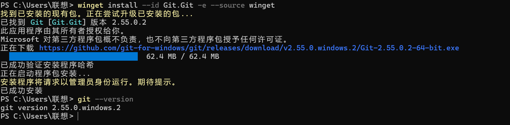

*图 1 Git 安装与版本验证。截图显示 Git 命令能够正常执行，证明版本管理工具已安装。*

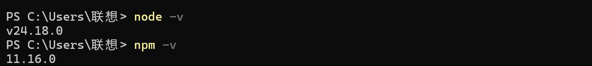

*图 2 Node.js 与 npm 版本验证。截图显示两个版本命令均有返回，证明 JavaScript 运行环境和包管理器可用。*

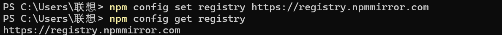

*图 3 npm 镜像源配置。截图显示 registry 查询结果，证明 npm 下载源配置已生效。*

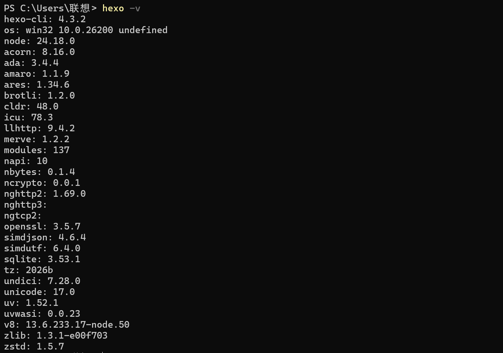

*图 4 Hexo 版本验证。截图显示 Hexo 及其运行环境信息，证明静态站点生成工具可用。*

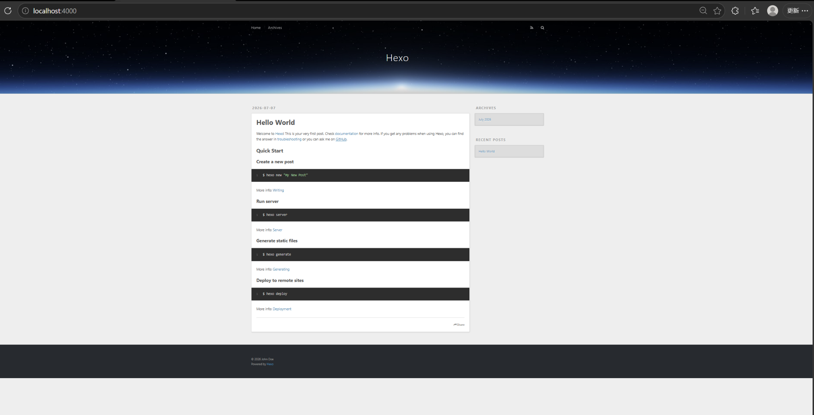

*图 5 Hexo 本地预览。浏览器能够打开 localhost:4000，证明本地 Web 运行环境配置成功。*

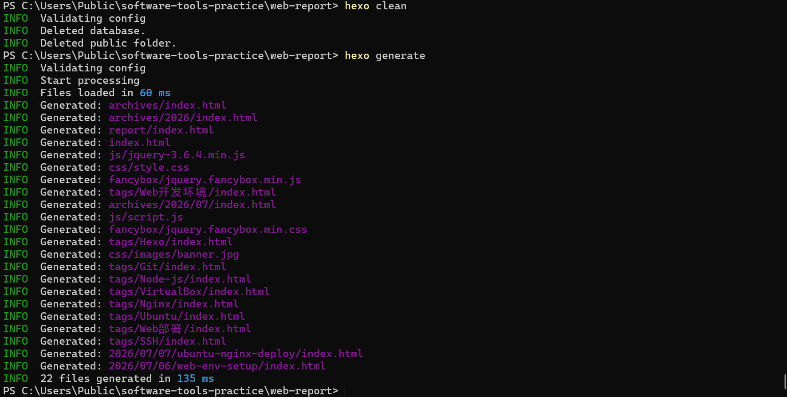

*图 6 Hexo 静态文件生成。命令输出包含报告页面生成记录，证明源文件能够生成到 public 目录。*

### 1.3 结果验证与问题记录

Git、Node.js、npm 和 Hexo 均能返回版本信息，Hexo 本地服务器可访问。使用 `winget` 下载 Node.js 时曾出现网络连接失败，之后改用可用安装来源完成安装；npm 默认源访问不稳定时，通过配置镜像源解决。

[返回目录](#报告目录)

---

## 二、实验二 代码编辑与管理

### 2.1 实验目标

使用 VS Code 编写 Markdown、HTML 和 Hexo 配置文件，使用 Git 记录项目阶段性修改，并保留可检查的提交历史。

### 2.2 关键操作

项目主要文件包括：

```text
source/_posts/web-env-setup.md
source/_posts/ubuntu-nginx-deploy.md
source/report/index.html
软件开发工具实践实验报告.md
_config.yml
```

Git 的主要操作为：

```powershell
git status
git add .
git commit -m "初始化 Web 开发环境静态报告"
git log --oneline --decorate -5
```

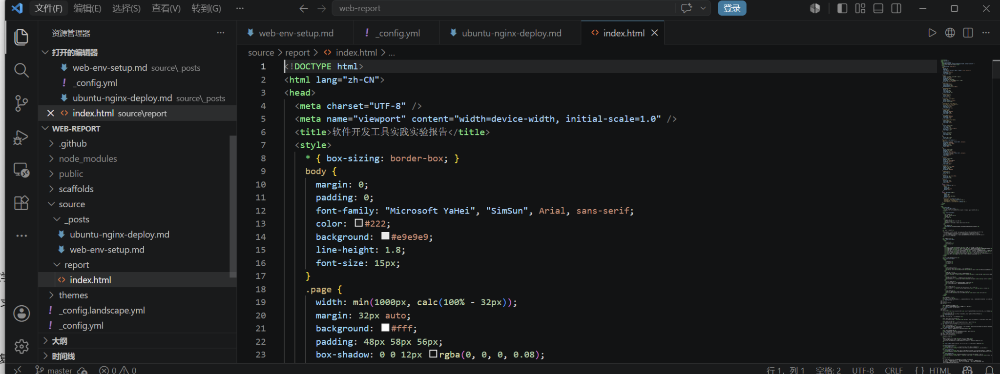

*图 7 VS Code 项目结构与报告页面。截图展示源码目录和报告文件，证明项目能够在编辑器中统一维护。*

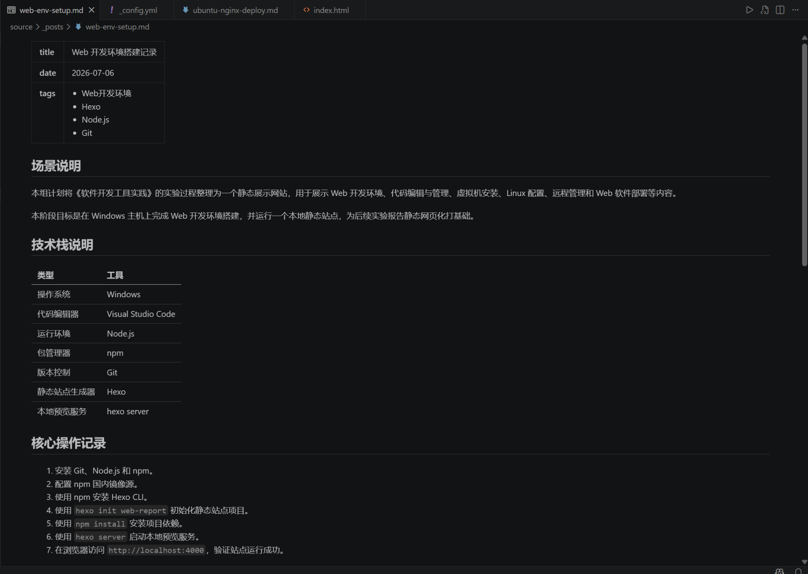

*图 8 VS Code Markdown 预览。截图展示 Markdown 源文和预览效果，证明报告可在提交前检查排版。*

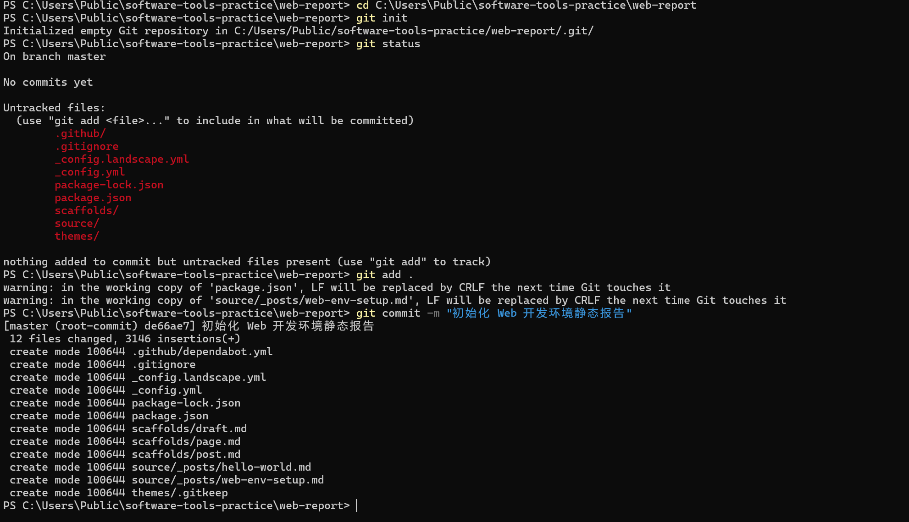

*图 9 Git 初始化与首次提交。截图记录仓库建立和首次提交，证明项目已纳入版本管理。*

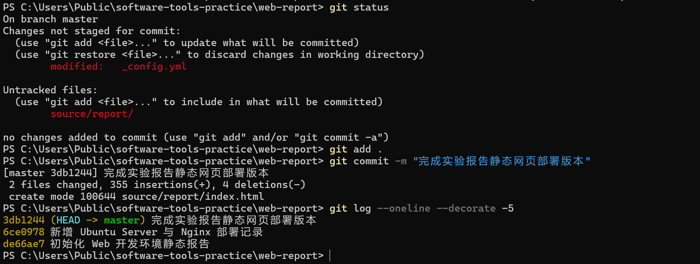

*图 24 Git 阶段性提交记录。截图展示多次提交历史，证明实验过程中的修改得到持续记录。*

### 2.3 结果验证

VS Code 能够编辑和预览报告，Git 能够显示工作区状态和提交记录。项目中的源码、配置、报告和截图按目录保存，便于后续生成与部署。

[返回目录](#报告目录)

---

## 三、实验三 虚拟机安装与配置

### 3.1 实验目标

使用 VirtualBox 创建 Ubuntu Server 22.04 LTS 虚拟机 `node1`，完成系统安装、OpenSSH Server 选择和基础网络验证，为 Linux 实验提供独立环境。

### 3.2 关键操作

| 项目 | 配置 |
|---|---|
| 虚拟化软件 | Oracle VM VirtualBox |
| 客户机系统 | Ubuntu Server 22.04 LTS |
| 虚拟机名称 | node1 |
| 网络模式 | NAT |
| 安装组件 | OpenSSH Server |

安装完成后，移除安装 ISO 并启动系统，登录后使用 `ip addr` 查看虚拟网卡状态和地址。

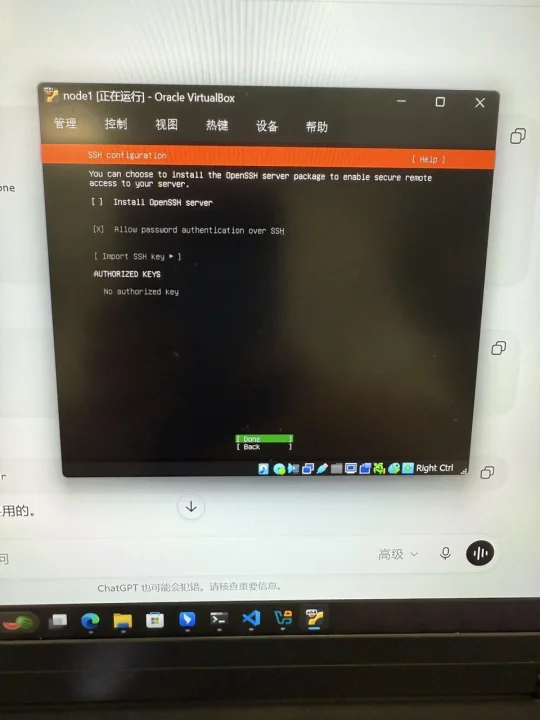

*图 10 Ubuntu 安装时启用 OpenSSH。截图显示安装阶段已选择 OpenSSH Server，证明远程管理组件被纳入系统安装。*

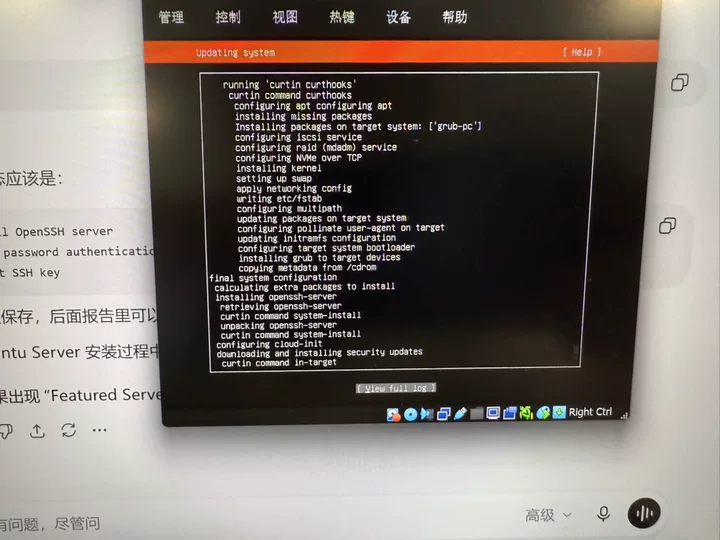

*图 11 Ubuntu Server 安装过程。截图记录安装程序执行状态，证明虚拟机系统正在按配置安装。*

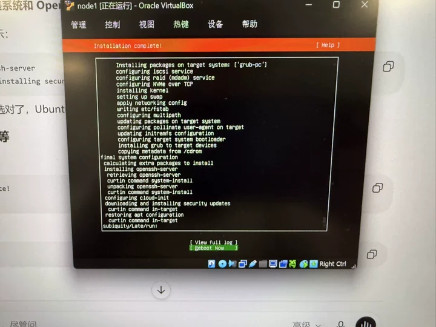

*图 12 Ubuntu Server 安装完成。截图显示系统可进入登录环境，证明 Ubuntu Server 已可运行。*

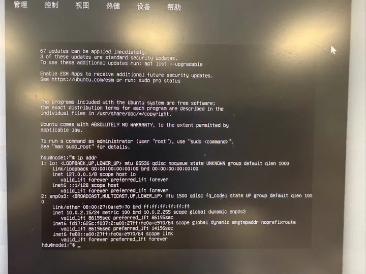

*图 13 Ubuntu 网络信息。`ip addr` 输出展示虚拟网卡状态，证明客户机网络接口已被系统识别。*

### 3.3 问题分析与结果验证

安装完成后曾遇到 VirtualBox 菜单中“移除虚拟盘片”不可用的问题。关闭虚拟机后在“存储”设置中移除 Ubuntu ISO，再启动虚拟机，系统可正常从虚拟磁盘进入 Ubuntu。最终虚拟机可登录，网络接口可查看，满足后续 Linux 操作条件。

[返回目录](#报告目录)

---

## 四、实验四 Linux 基本操作

### 4.1 实验目标

掌握 Linux 中系统信息查看、文件与目录管理、文本处理、软件包管理和系统资源查看等基础操作。

### 4.2 用户与系统信息

```bash
whoami
hostname
pwd
uname -a
cat /etc/os-release
```

上述命令分别验证当前用户、主机名、工作目录、内核信息和 Ubuntu 发行版信息。

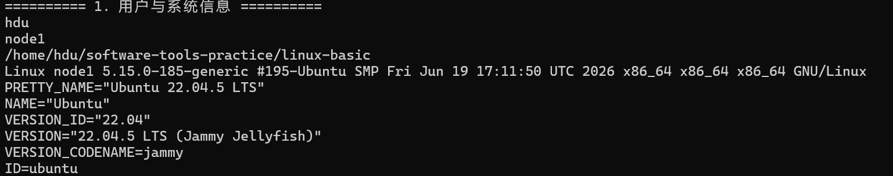

*图 31 Linux 用户与系统信息。截图集中显示用户、主机名、路径、内核和系统版本，证明基础系统信息查看命令执行成功。*

### 4.3 文件、目录、查找与文本处理

```bash
mkdir -p ~/software-tools-practice/linux-basic
cd ~/software-tools-practice/linux-basic
printf "software tools practice\nlinux command test\n" > course.txt
cp course.txt course-copy.txt
mv course-copy.txt renamed-course.txt
ls -l
cat course.txt
grep "linux" course.txt
find . -name "*.txt"
wc -l -w -c course.txt
```

这些命令完成目录创建、文本写入、复制、重命名、列表查看、内容读取、关键词查找、文件查找和统计。

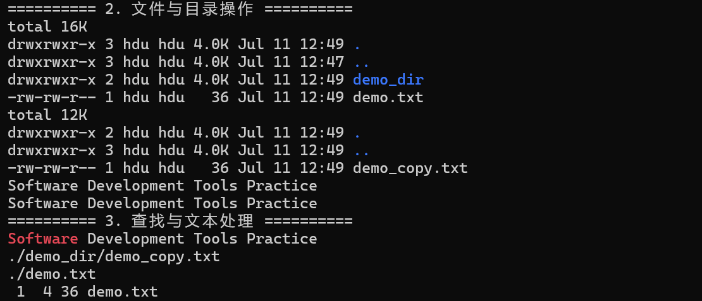

*图 32 Linux 文件与文本操作。截图显示文件操作及 grep、find、wc 的结果，证明基础文件管理和文本处理流程已完成。*

### 4.4 软件包与系统资源

```bash
sudo apt update
sudo apt install -y tree
which tree
tree --version
tree .
df -h /
free -h
```

`apt` 用于更新软件索引和安装 `tree`；`which`、`tree --version` 和 `tree .` 用于验证安装位置、版本和目录树；`df` 与 `free` 用于查看根分区和内存资源。

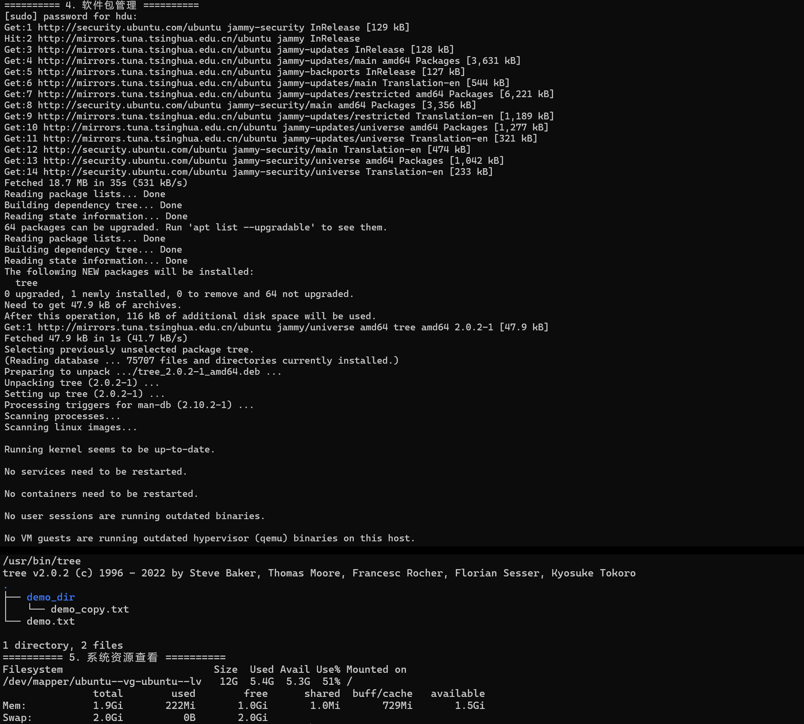

*图 33 Linux 软件包与系统资源验证。截图显示 tree 安装与运行结果以及磁盘、内存信息，证明软件包管理和资源查看操作成功。*

### 4.5 结果验证

本实验所列命令均有实际输出，创建的测试目录和文本文件可以被查找、读取和统计，`tree` 可正常运行，磁盘与内存状态可查询。

[返回目录](#报告目录)

---

## 五、实验五 Linux 账户与权限管理

### 5.1 实验目标

查看已有账户信息，创建实验用户和用户组，配置 Home 目录、共享目录、测试文件与 SSH 关键文件权限，并验证组权限生效。

### 5.2 账户、组和目录配置

首先查看已有 `hdu` 用户：

```bash
id hdu
getent passwd hdu
echo $HOME
groups hdu
ls -ld /home/hdu
```

随后创建 `webteam` 组和 `webstudent` 账户。`webstudent` 的 Home 为 `/home/webstudent`，Shell 为 `/bin/bash`；将 `hdu` 和 `webstudent` 加入 `webteam`。

实验目录和文件的最终配置为：

| 对象 | 所有者与组 | 权限 |
|---|---|---:|
| `/home/webstudent` | `webstudent:webteam` | `750` |
| `/home/webstudent/course-share` | `webstudent:webteam` | `750` |
| `account-test.txt` | `webstudent:webteam` | `640` |
| `~/.ssh` | hdu 用户 | `700` |
| `~/.ssh/authorized_keys` | hdu 用户 | `600` |

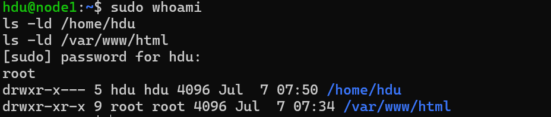

*图 19 Linux 用户与目录权限初步验证。截图显示普通用户、sudo 和目录权限信息，证明账户与 Web 目录权限可以被查询。*

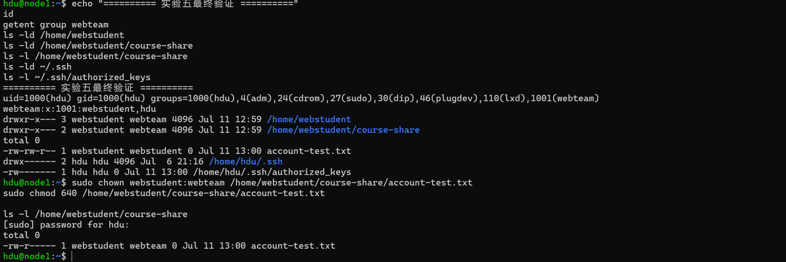

*图 34 Linux 账户与权限最终验证。截图显示 hdu、webstudent、webteam、Home、共享目录和 SSH 文件权限，证明最终权限配置符合实验要求。*

### 5.3 问题分析

最初 `hdu` 访问 `/home/webstudent/course-share` 时出现 `Permission denied`。虽然 `course-share` 属于 `webteam`，但上级目录 `/home/webstudent` 的所属组和当前 SSH 会话中的用户组状态未正确刷新，导致 `hdu` 无法穿越上级目录。

处理步骤为：将 `/home/webstudent` 的所属组改为 `webteam`，权限设为 `750`；退出 SSH 后重新登录，使新增组身份生效。重新验证后，`hdu` 可以访问共享目录。

### 5.4 结果验证

账户、组、Home、共享目录、测试文件和 SSH 关键文件权限均达到预期，权限错误的原因和处理过程有客观记录。

[返回目录](#报告目录)

---

## 六、实验六 Linux 环境配置

### 6.1 实验目标

分别配置系统级和用户级 Shell 环境变量，理解 `/etc/profile.d/`、`~/.profile` 与 `~/.bashrc` 的作用范围，并通过重新登录验证配置持久化。

### 6.2 系统级配置

创建 `/etc/profile.d/software-tools-practice.sh`，所有者和权限为 `root:root`、`644`，内容为：

```bash
export WEB_ROOT="/var/www/html"
export REPORT_PATH="/var/www/html/report"
export COURSE_ENV="software-tools-practice"
```

`/etc/profile.d/` 中的脚本面向登录 Shell 的系统级环境初始化，适合配置需要由多个用户读取的统一变量。

### 6.3 用户级配置

在 `~/.bashrc` 中加入：

```bash
export USER_WORKSPACE="$HOME/software-tools-practice"
alias cpractice='cd "$USER_WORKSPACE"'
```

`~/.bashrc` 只影响当前用户的 Bash 交互环境；Ubuntu 默认的 `~/.profile` 会在登录时按条件加载 `~/.bashrc`。使用 `source` 可在当前会话立即加载修改，但仅执行 `source` 不能证明新登录会话也会自动加载，因此还需要退出 SSH 并重新登录。

验证结果为：

```text
WEB_ROOT=/var/www/html
REPORT_PATH=/var/www/html/report
COURSE_ENV=software-tools-practice
USER_WORKSPACE=/home/hdu/software-tools-practice
```

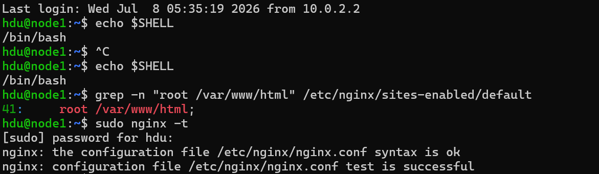

*图 21 Linux Nginx 配置与环境初步验证。截图显示 Shell、Nginx root 和配置检测结果，证明 Web 目录及运行环境信息可查询。*

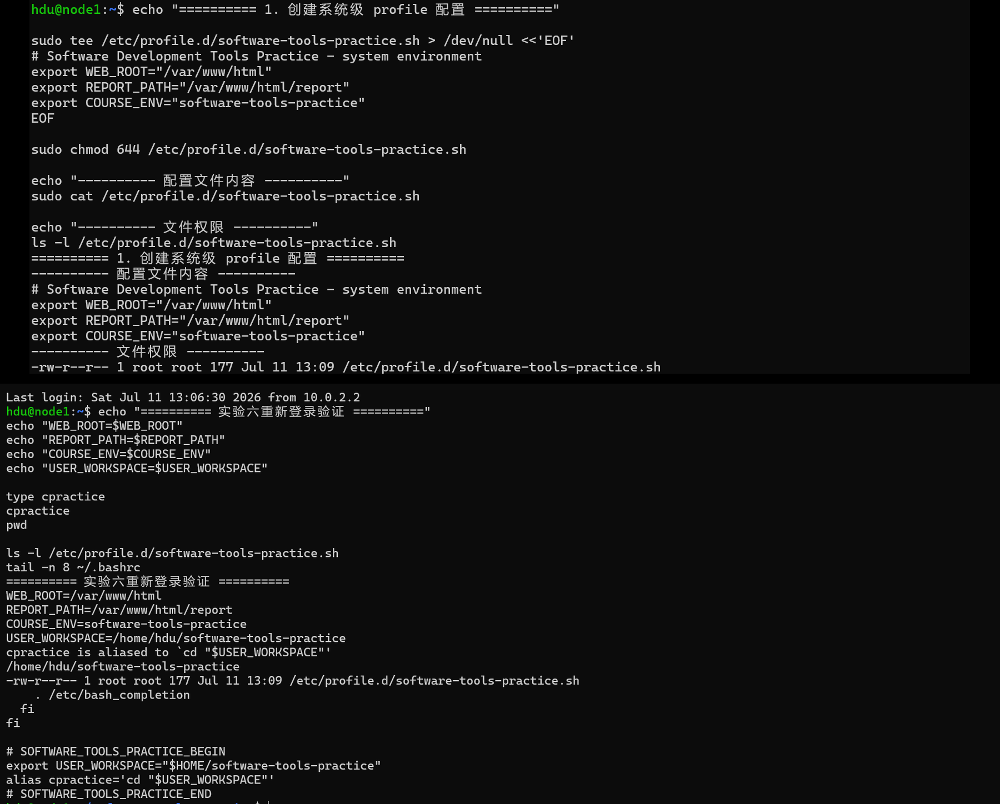

*图 35 Linux 环境变量持久化验证。截图显示重新登录后变量和 cpractice 仍存在，证明系统级与用户级配置能够持久生效。*

### 6.4 结果验证

系统级变量和用户级变量均能在新 SSH 会话中读取，`cpractice` 可切换到用户工作目录，权限与加载范围符合预期。

[返回目录](#报告目录)

---

## 七、实验七 远程管理

### 7.1 实验目标

配置并验证 OpenSSH Server，通过 VirtualBox NAT 端口映射从 Windows 登录 Ubuntu，增加基础安全配置，并使用 SCP 完成文件传输。

### 7.2 SSH 服务与端口转发

OpenSSH Server 已安装，服务状态为 `enabled`、`active`，Ubuntu 内部监听端口为 `22`。VirtualBox 将 Windows `127.0.0.1:2222` 映射到 Ubuntu `22`。

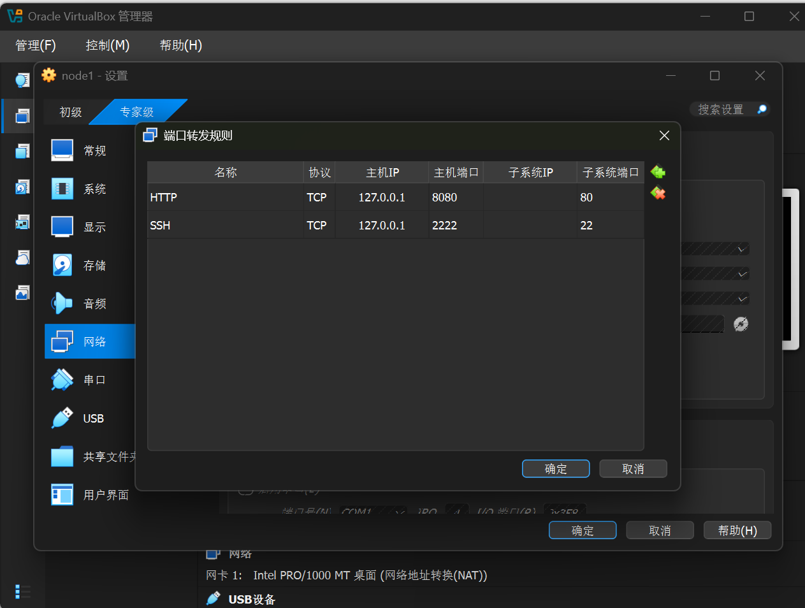

*图 14 VirtualBox NAT 端口转发。截图显示 HTTP 与 SSH 转发规则，证明 Windows 可以通过本机端口访问虚拟机服务。*

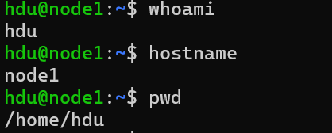

*图 15 Windows SSH 登录 Ubuntu。截图显示 hdu 登录 node1 后的身份与目录信息，证明 2222 到 22 的 SSH 通道可用。*

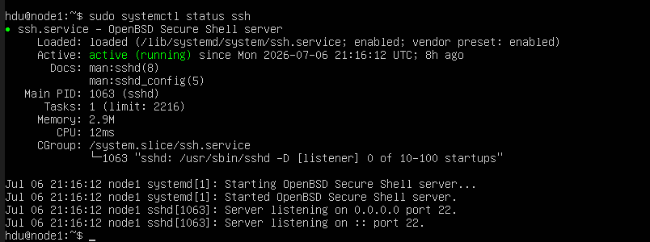

*图 16 SSH 服务状态。截图显示 OpenSSH 服务处于运行状态，证明远程登录服务已启动。*

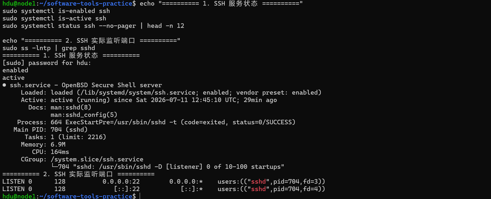

*图 36 SSH 服务与监听端口。截图同时显示服务启用、运行和 22 端口监听结果，证明 Ubuntu 端 SSH 服务配置完整。*

### 7.3 SSH 安全配置

有效配置检查包含：

```text
port 22
pubkeyauthentication yes
passwordauthentication yes
maxauthtries 6
```

新增 `/etc/ssh/sshd_config.d/99-course-security.conf`：

```text
PermitRootLogin no
```

执行以下命令检查语法并重启服务：

```bash
sudo sshd -t
sudo systemctl restart ssh
sudo systemctl is-active ssh
```

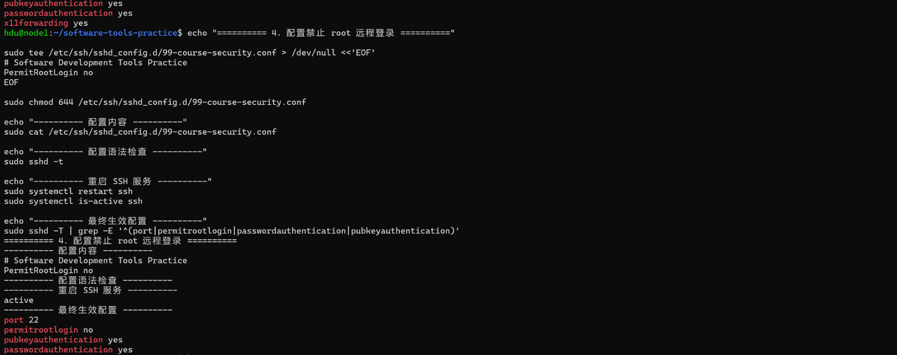

*图 37 SSH 安全配置。截图仅保留正确配置、语法检查和生效结果，证明 root 远程登录已禁止且 SSH 服务仍正常。*

### 7.4 SSH 与 SCP 验证

Windows 登录命令为：

```powershell
ssh -p 2222 hdu@127.0.0.1
```

文件传输验证命令为：

```powershell
scp -P 2222 ssh-transfer-test.txt hdu@127.0.0.1:~/software-tools-practice/
```

Ubuntu 中读取到的内容为：

```text
Remote management transfer test
```

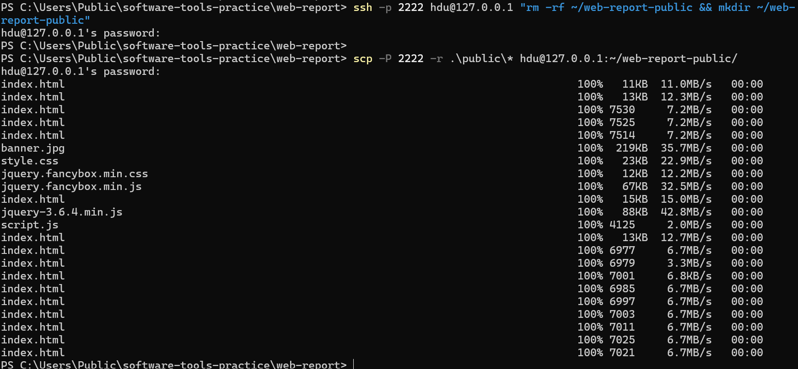

*图 18 SCP 上传 Hexo public 目录。截图记录批量文件传输过程，证明 SCP 可用于部署文件上传。*

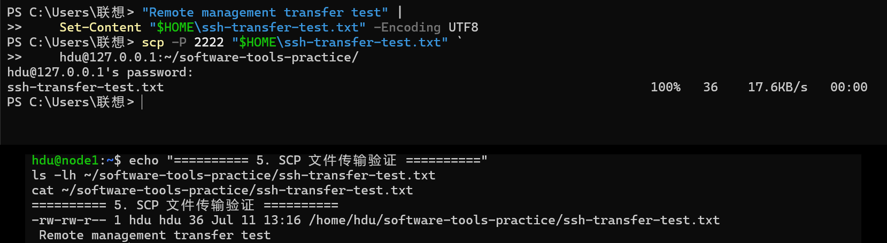

*图 38 SCP 测试文件传输验证。截图同时显示 Windows 上传和 Ubuntu 读取结果，证明远程文件内容保持正确。*

### 7.5 结果验证

SSH 服务、监听端口、NAT 映射和安全配置均通过检查；Windows 能使用普通用户登录 Ubuntu 并通过 SCP 上传文件。首次输入密码错误曾导致 `Permission denied`，确认用户名、端口并重新输入正确密码后传输成功。

[返回目录](#报告目录)

---

## 八、实验八 Web 软件部署

### 8.1 实验目标

使用实际存在且已成功运行的 `deploy.ps1` 自动完成 Hexo 构建、SSH/SCP 上传、Nginx 静态文件部署、权限设置、配置检查和 HTTP 结果验证。

### 8.2 Nginx 与部署目录

Nginx 站点目录为 `/var/www/html/`，报告入口为 `/var/www/html/report/index.html`。

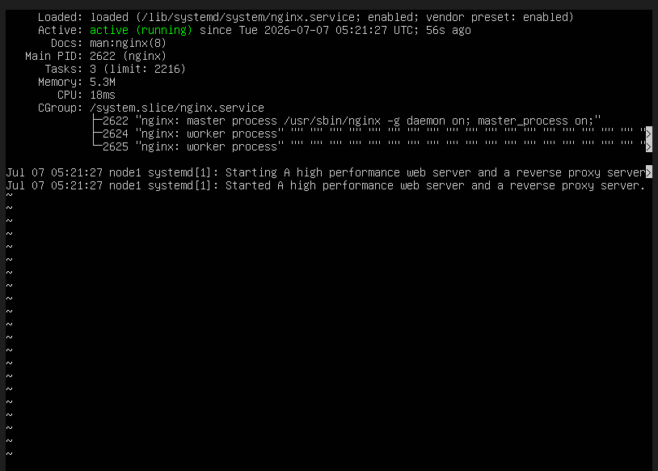

*图 17 Nginx 服务状态。截图显示 Nginx 正在运行，证明静态 Web 服务已启动。*

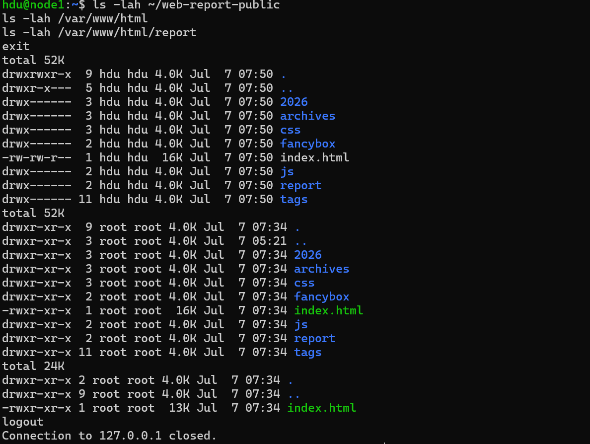

*图 20 Nginx 部署目录验证。截图显示 `/var/www/html` 和 report 目录内容，证明静态文件已复制到服务目录。*

### 8.3 自动部署脚本

`deploy.ps1` 的流程为：检查项目本地 Hexo，执行 `clean` 和 `generate`，检查 `public/report/index.html`，清理远程临时目录，SCP 上传 `public`，复制到 `/var/www/html`，为目录设置 `755`、为文件设置 `644`，执行 `nginx -t`，重新加载 Nginx，检查报告文件并用 HTTP 请求验证状态。

报告仅摘录脚本关键逻辑：

```powershell
& $HexoCommand clean
& $HexoCommand generate
if (-not (Test-Path $ReportIndex)) { throw "Generated report was not found" }
& scp -P $SshPort -r $PublicDirectory $RemoteTarget
& ssh -tt -p $SshPort "${RemoteUser}@${ServerHost}" $RemoteCommand
& curl.exe -I "http://127.0.0.1:8080/report/"
```

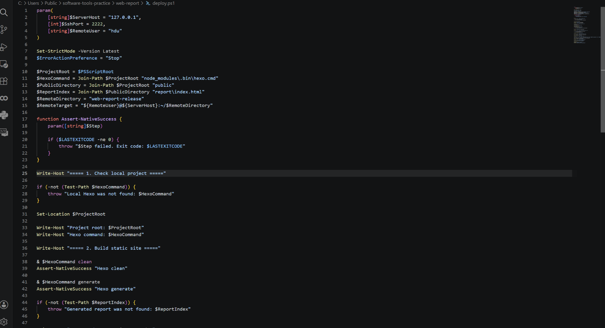

*图 39 自动部署脚本源码。截图展示 deploy.ps1 的实际关键代码，证明构建、上传、部署和检查步骤已实现为脚本。*

### 8.4 HTTP 访问验证

本机访问地址为 `http://127.0.0.1:8080/report/`。部署脚本最终输出包括：

```text
Nginx deployment completed.
HTTP/1.1 200 OK
Deployment succeeded.
```

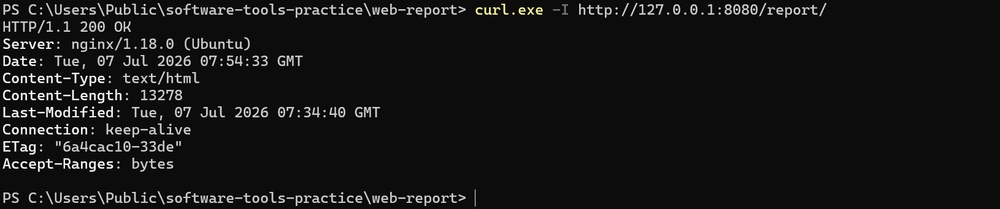

*图 22 Nginx HTTP 200 OK。curl 响应包含 HTTP 200，证明 Nginx 能返回报告页面。*

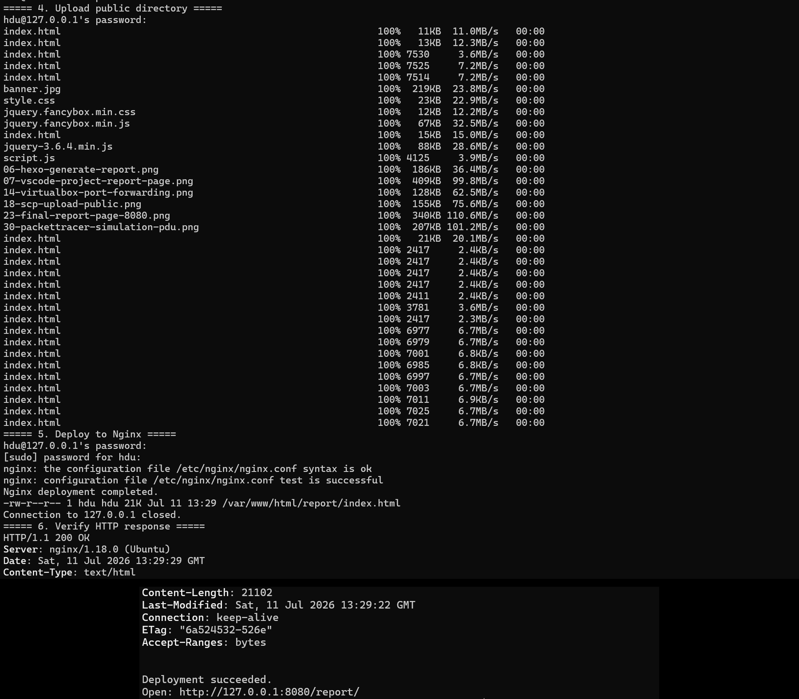

*图 40 自动部署与 HTTP 成功结果。截图汇总上传、Nginx 检查、HTTP 200 和成功提示，证明 deploy.ps1 已完整运行成功。*

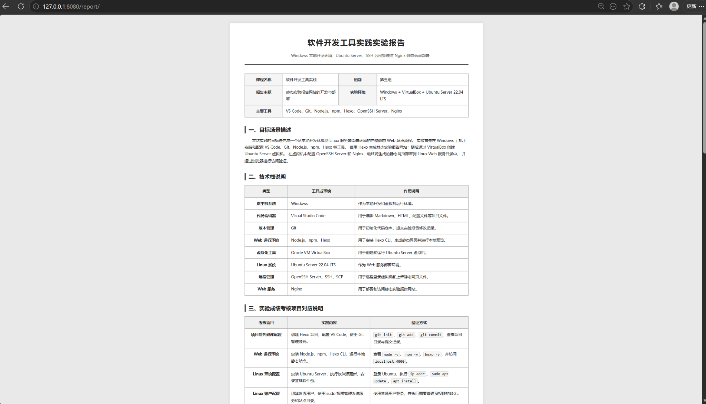

*图 23 最终部署页面。浏览器显示报告内容，证明静态 HTML 已通过 Ubuntu Nginx 发布。*

### 8.5 局域网发布与多终端访问

原规则 `127.0.0.1:8080` 仅供 Windows 本机访问。为在校园网局域网内验证访问，新增 VirtualBox NAT 转发：

```text
HTTP-LAN,tcp,0.0.0.0,8081,,80
```

同时新增 Windows 防火墙规则：

```text
DisplayName: VirtualBox Nginx LAN 8081
Direction: Inbound
Action: Allow
Profile: Any
```

实验时 Windows 校园网 IPv4 地址为 `10.150.103.10`，局域网访问地址为 `http://10.150.103.10:8081/report/`。`0.0.0.0:8081` 表示 Windows 所有网络接口均可接收 8081 端口请求，再由 VirtualBox 转发到 Ubuntu 的 80 端口。Nginx 能同时处理多个终端请求，因此同一局域网中的设备可使用同一地址访问，不需要为每台设备单独设置端口。

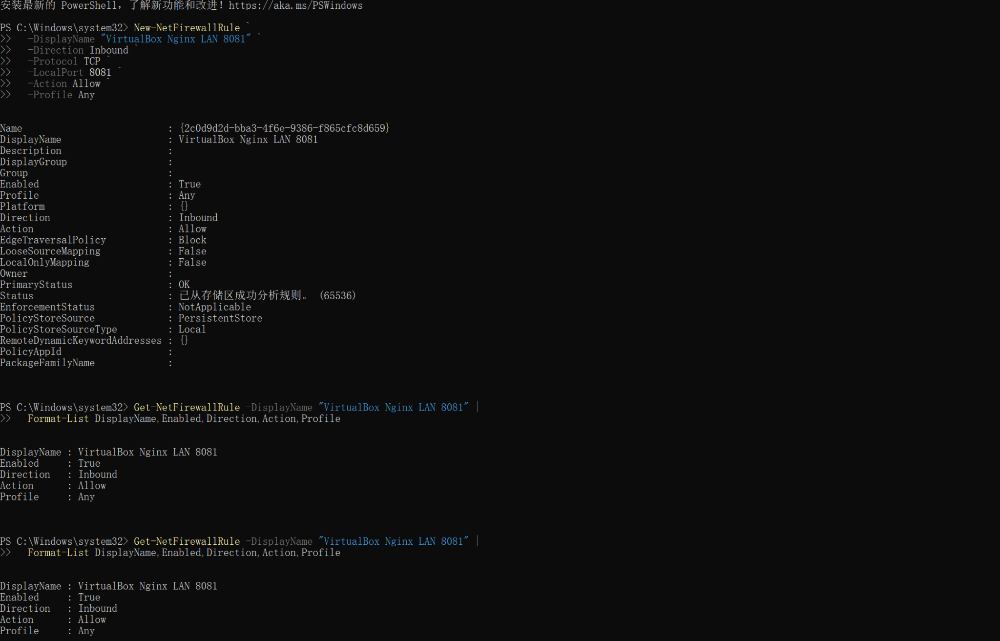

*图 41 Windows 防火墙 8081 入站规则。截图显示入站放行规则已启用，证明局域网请求可进入 Windows 转发端口。*

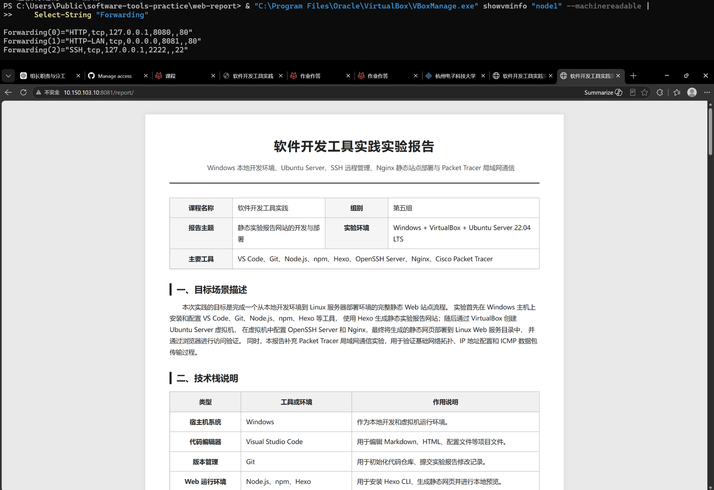

*图 42 校园网端口转发与访问。截图显示 0.0.0.0:8081 转发配置和校园网地址页面，证明局域网地址访问验证成功。*

当前已经完成局域网地址访问验证，并具备多终端同时访问条件；现有证据未显示三台设备同时出现在同一画面，因此不作“三台设备已同时访问”的表述。本节描述的是局域网发布，不是公网发布。

### 8.6 问题分析与结果验证

首次部署后曾出现页面内容存在但样式未完整加载的问题。重新执行 Hexo 清理与生成，并上传完整 `public` 目录中的 HTML、CSS、脚本和图片资源后恢复。中文乱码问题通过 UTF-8 保存和 HTML 中的 `<meta charset="UTF-8" />` 解决。最终本机和校园网局域网地址均完成访问验证。

[返回目录](#报告目录)

---

## 九、扩展实验：Packet Tracer 局域网通信

### 9.1 实验定位与目标

Packet Tracer 是在正式八个实验之外补充的网络基础扩展实践，不能替代大纲要求的 Linux 基本操作、账户权限或环境配置。本实验用于观察简单局域网拓扑、IP 配置、Ping 和 ICMP 数据包转发。

### 9.2 安装、拓扑与地址配置

Cisco Packet Tracer 已完成安装并运行。拓扑结构为：

```text
PC0 — Switch — PC1
```

| 设备 | IPv4 地址 | 子网掩码 |
|---|---|---|
| PC0 | `192.168.1.1` | `255.255.255.0` |
| PC1 | `192.168.1.2` | `255.255.255.0` |

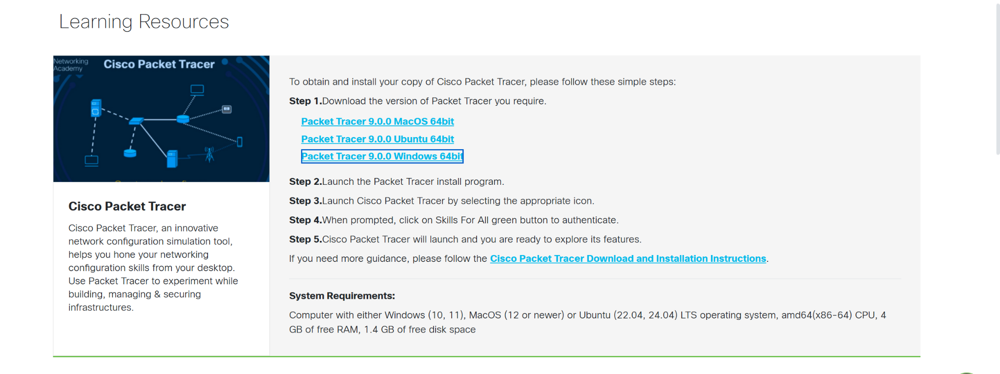

*图 25 Packet Tracer 官方下载页面。截图记录软件获取入口，证明安装材料来源明确。*

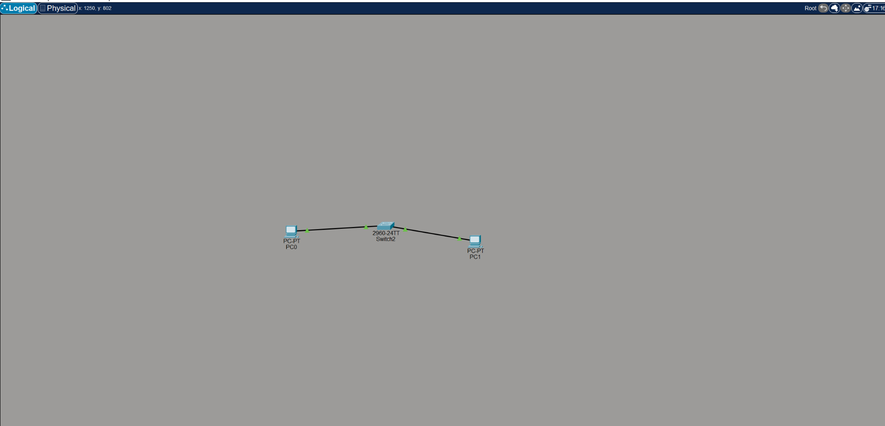

*图 26 Packet Tracer 简单局域网拓扑。截图显示 PC0、Switch 和 PC1 的连接，证明基础拓扑已搭建。*

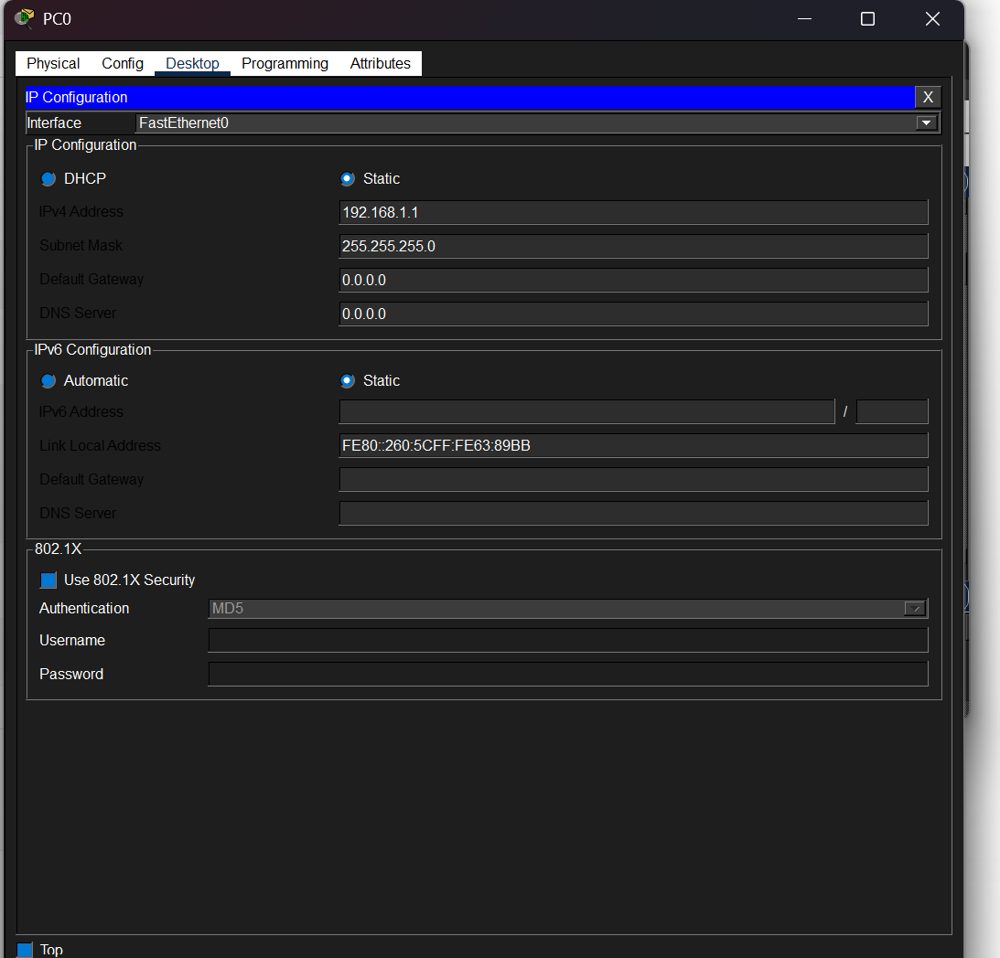

*图 27 PC0 IP 配置。截图显示 192.168.1.1/24，证明发送端地址配置正确。*

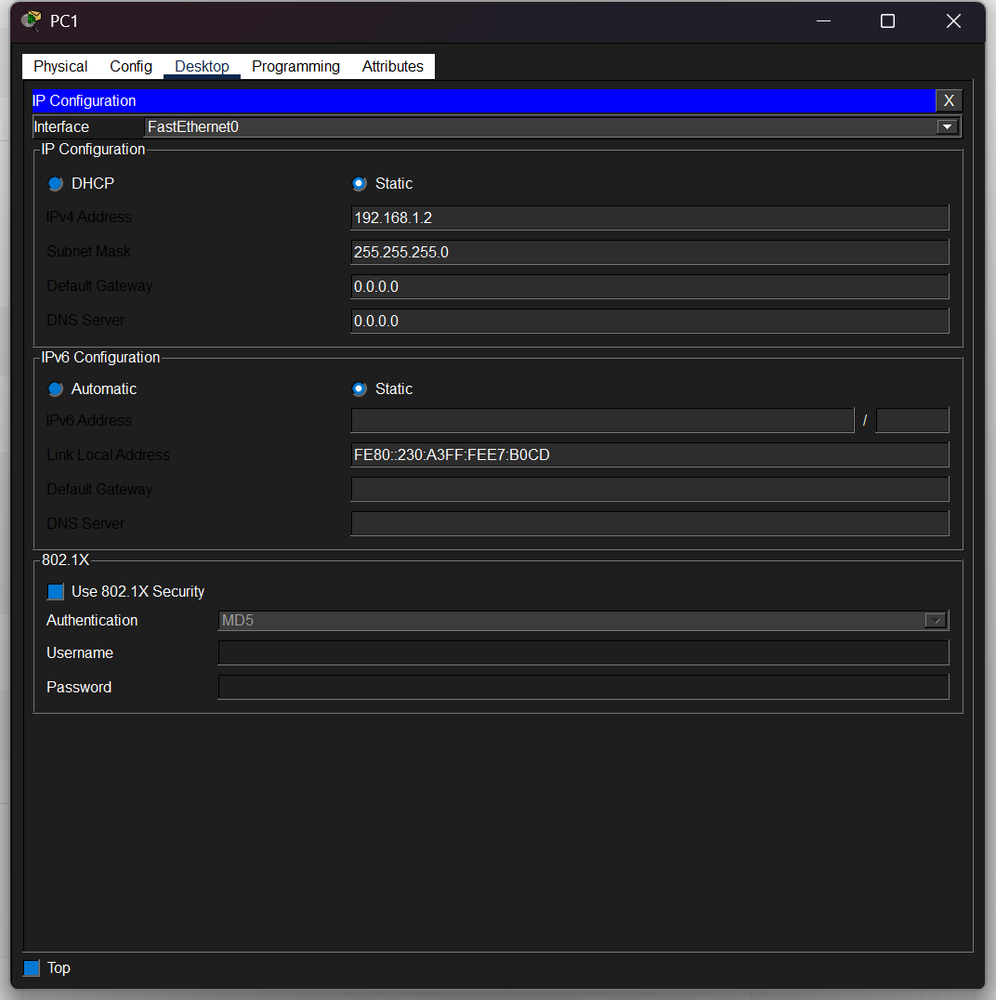

*图 28 PC1 IP 配置。截图显示 192.168.1.2/24，证明接收端与 PC0 位于同一网段。*

### 9.3 Ping 与 Simulation 验证

PC0 执行 `ping 192.168.1.2`，结果为：

```text
Sent = 4
Received = 4
Lost = 0
```

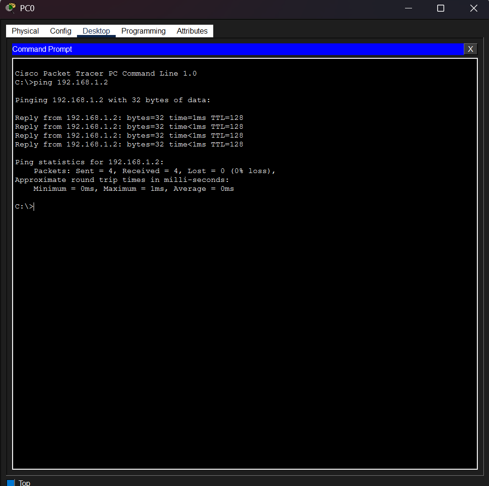

*图 29 Packet Tracer Ping 成功。四个数据包全部收到且无丢失，证明 PC0 与 PC1 通信正常。*

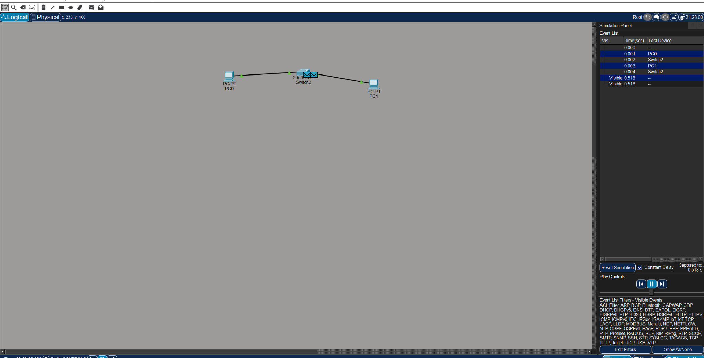

*图 30 Packet Tracer Simulation ICMP 数据包。截图显示 ICMP 数据包经过 PC0、Switch、PC1，证明通信过程可在仿真模式中观察。*

[返回目录](#报告目录)

---

## 十、技术展望

### 10.1 主题：将 Hexo 手工部署升级为 GitHub Actions + SSH 自动化部署

当前方案是在 Windows 本地维护 Hexo 项目，手动运行 `deploy.ps1`，通过 SSH/SCP 上传到 Ubuntu，再由 Nginx 发布。该方案已经能够完成部署，但仍需要人工启动脚本和输入认证信息，依赖本地电脑环境，也可能因漏执行生成或上传步骤造成版本不一致。

可调研的替代方案包括 GitHub Actions、GitLab CI/CD、Jenkins 和 Gitee Go；站点工具还可比较 VitePress、Hugo，Web 服务可继续使用 Nginx或调研 Caddy 自动 HTTPS。结合现有 GitHub 仓库、Hexo 源码、SSH 和 Nginx 环境，最终升级方向选择 **GitHub Actions + SSH Key + Nginx**。

### 10.2 升级流程

1. 向 `main` 分支推送经检查的源码。
2. GitHub Actions 检出代码并安装指定版本的 Node.js。
3. 执行 `npm ci`，按锁文件安装依赖。
4. 执行 `npx hexo clean` 和 `npx hexo generate`。
5. 将部署专用 SSH 私钥存入 GitHub Actions Secrets，不写入仓库。
6. 使用 `rsync` 或 `scp` 上传到带时间戳的远程暂存目录。
7. 服务器执行 `nginx -t`，检查通过后切换当前版本并 reload Nginx。
8. 对报告地址执行 HTTP 检查；若构建、上传或配置检查失败，立即中止部署。

### 10.3 风险、回滚与验收

主要风险包括私钥泄露、Secrets 配置错误、上传中断、Nginx 配置错误和 Actions 权限不足。应使用权限最小化的部署账户和密钥，限制可部署分支，不在日志中输出敏感值，并保留部署历史。

远程目录可按时间戳保存 release，以软链接指向当前版本。部署失败时恢复 `previous` 指向的上一版本，不直接删除旧版本。验收标准为：推送后工作流自动运行、依赖安装和 Hexo 构建成功、页面正常显示、HTTP 返回 200、整个流程不需要手工 SCP。

### 10.4 调研方法与参考资料

调研方法包括阅读官方文档、检索 GitHub Actions Marketplace、分析开源项目 workflow、查阅技术社区文章并进行对比实验。参考资料采用以下可核验来源：

1. [GitHub Actions：Deployments and environments](https://docs.github.com/en/actions/reference/workflows-and-actions/deployments-and-environments)
2. [GitHub Actions：Using secrets in GitHub Actions](https://docs.github.com/en/actions/how-tos/write-workflows/choose-what-workflows-do/use-secrets)
3. [Hexo 官方文档](https://hexo.io/docs/)
4. [Hexo 命令文档](https://hexo.io/docs/commands)
5. [Nginx 官方文档](https://nginx.org/en/docs/)
6. [OpenSSH sshd_config 手册](https://man.openbsd.org/sshd_config)
7. [Git 官方参考文档](https://git-scm.com/docs)
8. [The Missing Semester：Version Control and Git](https://missing.csail.mit.edu/2026/version-control/)

[返回目录](#报告目录)

---

## 十一、实践总结、心得体会与意见建议

### 11.1 客观实践总结

本次实践形成了以下可验证流程：在 Windows 配置 Web 开发工具，使用 VS Code 编写报告并由 Git 管理版本；在 VirtualBox 中安装 Ubuntu Server，完成 Linux 基本操作、账户权限和环境变量配置；通过 SSH 与 SCP 远程管理；由 Hexo 生成静态文件并使用 Nginx 发布；最后分别通过本机地址和校园网局域网地址验证访问。Packet Tracer 内容作为正式八个实验之外的扩展实践单独记录。

### 11.2 实验心得体会
这次实践刚开始的时候，我以为主要就是安装软件、照着手册输命令，再把截图放进报告里。真正做下来以后才发现，八个实验其实是连在一起的。前面搭建 Windows 开发环境和 Hexo 项目，后面又要把网页传到 Ubuntu，再通过 Nginx 发布，少了任何一步，最后的网站都跑不起来。

整个过程中我遇到的问题比预想中多。最明显的一次是我启动虚拟机之后，没有先通过 SSH 进入 Ubuntu，就直接在 Windows PowerShell 里执行了 uname、grep、apt 等 Linux 命令，结果全部报错。当时我还以为是虚拟机或者命令有问题，后来才发现自己根本没有进入 Linux 环境。配置 Linux 账户权限时，我给共享目录设置了用户组和权限，但 hdu 访问时还是出现 Permission denied，最后检查才发现上级 Home 目录的所属组和当前 SSH 会话的用户组状态都会影响访问，修改权限并重新登录后才正常。后面写 deploy.ps1 时又遇到了中文乱码和 here-string 被提前截断的问题，脚本看起来写好了，实际上有一部分命令却直接在 PowerShell 中运行了。这个过程让我意识到，看到报错不能只反复重试，应该先确认自己当前在哪个环境，再检查路径、权限、端口、编码和服务状态。

最后部署脚本能够自动执行 Hexo 构建、SCP 上传、Nginx 配置检查和 HTTP 状态验证，并成功返回 HTTP/1.1 200 OK。我还通过校园网地址打开了部署在 Ubuntu 中的网页。相比一开始只会在本地打开 HTML，现在我对从代码编辑、版本管理、文件传输到服务器部署的整个流程有了更完整的理解。

这次实践给我最大的感受是，很多工具单独看并不难，真正麻烦的是把它们连接起来，并且保证每一个环节都正确。Git、VirtualBox、Linux、SSH 和 Nginx 以前在我看来是几块分开的内容，这次做完后才真正理解它们在一个项目里分别负责什么。以后再遇到类似问题，我应该会比以前更愿意根据报错一步一步定位，而不是直接重装或者从头再做。


### 11.3 意见与建议

我觉得这门实践课的内容比较实用，特别是 Linux 权限、SSH 远程登录和 Web 部署这些部分，和以后真正做项目有比较直接的联系。以前学编程时更多关注代码本身，这次能够看到网页怎样从本地文件变成服务器上可以访问的站点，体验还是比较完整的。

不过八个实验集中在一周左右完成，后半部分内容比较密集，Linux 账户权限、环境变量、端口转发和部署很容易混在一起。建议以后可以提前提供一个统一的目录结构和最终成果示例，并在课堂上完整演示一次“本地生成网页—SSH 登录—SCP 上传—Nginx 部署—其他设备访问”的全过程。GitHub 小组协作方面也可以增加一次分支创建、Pull Request、冲突处理和合并的演示，这样组员各自在不同分支提交材料时会更清楚，也不容易把文件传到错误目录。

[返回目录](#报告目录)

---

## 十二、六项考核内容对应表

| 考核项目 | 报告对应内容 | 关键证据 |
|---|---|---|
| 项目与代码库配置 | 实验二 | VS Code、Git、GitHub、提交记录 |
| Web 运行环境 | 实验一 | Node.js、npm、Hexo、localhost |
| Linux 环境配置 | 实验六 | profile.d、bashrc、环境变量 |
| Linux 账户配置 | 实验五 | hdu、webstudent、webteam、Home、权限 |
| 远程管理配置 | 实验七 | SSH、端口、登录安全、SCP |
| Web 站点部署 | 实验八 | deploy.ps1、Nginx、HTTP 200、LAN 访问 |

Packet Tracer 仅作为扩展实验，不强行映射到上述六项考核内容。

[返回目录](#报告目录)

---

## 十三、证据材料清单

| 类别 | 文件编号 | 对应内容 |
|---|---|---|
| Git / Node.js / npm / Hexo | 01–06、09、24 | 开发环境、构建和版本记录 |
| VS Code / Markdown | 07–08 | 源码编辑与报告预览 |
| VirtualBox / Ubuntu Server | 10–14 | 虚拟机安装与网络配置 |
| Linux 基本操作 | 31–33 | 系统信息、文件文本、软件包和资源 |
| Linux 账户与权限 | 19、34 | 用户、组、Home、共享目录和权限 |
| Linux 环境配置 | 21、35 | profile.d、bashrc 与持久化 |
| SSH / SCP | 15–16、18、36–38 | 服务、端口、安全登录和文件传输 |
| Nginx / 自动部署 / LAN | 17、20、22–23、39–42 | 服务、脚本、HTTP 200 与局域网访问 |
| Packet Tracer | 25–30 | 安装来源、拓扑、IP、Ping 和 Simulation |
| 工程文件 | `deploy.ps1`、`packettracer-simple-lan.pkt` | 自动部署脚本和网络仿真工程 |

所有 Markdown 图片均使用 `./实验截图/文件名.png` 相对路径。HTML 报告中的图片统一使用 `./images/文件名.png`，由 Hexo 生成到 `public/report/images/`。

[返回目录](#报告目录)
