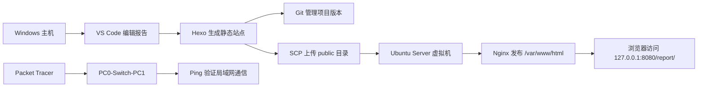

# 软件开发工具实践实验报告

> **第五组 · 静态实验报告网站开发与部署**  
> 关键词：Packet Tracer · Windows · VS Code · Git · Node.js · Hexo · VirtualBox · Ubuntu Server · SSH · SCP · Nginx

---

## 0. 报告导航

本报告不按传统“流水账模板”展开，而采用 **“场景任务 → 工具链 → 证据链 → 问题复盘 → 技术展望”** 的结构，展示一次从网络基础认知到 Web 服务部署的完整实践。

| 模块 | 目标 | 关键证据 |
|---|---|---|
| 网络软件基础 | 使用 Packet Tracer 搭建简单局域网并验证通信 | 拓扑、IP 配置、Ping 成功、Simulation 数据包流动 |
| 本地开发环境 | 在 Windows 上搭建 Web 开发环境 | Git、Node.js、npm、Hexo 版本与镜像源 |
| 代码编辑与管理 | 使用 VS Code 与 Git 管理实验项目 | VS Code 项目截图、Markdown 预览、Git commit/log |
| 站点构建 | 使用 Hexo 生成静态实验报告网站 | `hexo clean`、`hexo generate`、`localhost:4000` |
| 虚拟机与 Linux | 使用 VirtualBox 安装 Ubuntu Server | Ubuntu 安装、IP 地址、OpenSSH、Nginx 服务 |
| 远程管理 | 使用 SSH/SCP 完成远程登录和文件传输 | 端口转发、SSH 登录、SCP 上传 |
| Web 部署 | 使用 Nginx 发布静态网页 | `/var/www/html`、`curl 200 OK`、最终访问页 |

---

## 1. 项目场景：从“能写网页”到“能发布网页”

本实验模拟一个小型 Web 项目从开发到部署的完整流程：



本组完成的核心目标是：

1. 在 Windows 主机上搭建 Web 开发环境。
2. 使用 VS Code 编写 Markdown 与 HTML 实验报告。
3. 使用 Hexo 构建静态站点。
4. 使用 Git 管理项目版本。
5. 使用 VirtualBox 安装 Ubuntu Server。
6. 配置 OpenSSH、Nginx 与端口转发。
7. 通过 SSH/SCP 完成远程管理与文件上传。
8. 将静态网页部署到 Linux Web 服务目录，并通过浏览器访问。
9. 使用 Packet Tracer 补充完成网络软件基础实验。

---

## 2. 实验一：网络软件基础与 Packet Tracer 局域网通信

### 2.1 实验目的

Packet Tracer 是一款网络仿真软件，可以在不使用真实交换机、路由器和网线的情况下模拟网络拓扑、设备连接和数据包传输。本实验用于理解：

- 桌面网络软件的基本使用方式；
- C/S、B/S、P2P 等网络软件架构；
- 局域网中主机、交换机、IP 地址、子网掩码之间的关系；
- 主机间 ICMP Ping 通信过程。

### 2.2 实验拓扑

本实验搭建最小局域网：

```text
PC0  ——  Switch2  ——  PC1
```


### 2.3 IP 地址配置

| 设备 | IPv4 地址 | 子网掩码 | 说明 |
|---|---:|---:|---|
| PC0 | `192.168.1.1` | `255.255.255.0` | 测试发起端 |
| PC1 | `192.168.1.2` | `255.255.255.0` | 测试接收端 |

PC0 配置：


PC1 配置：


### 2.4 连通性验证

在 PC0 的 Command Prompt 中执行：

```bash
ping 192.168.1.2
```

结果显示 4 个数据包全部成功返回：

```text
Sent = 4, Received = 4, Lost = 0
```


### 2.5 Simulation 数据包观察

切换到 Simulation 模式后，使用 Add Simple PDU 观察 ICMP 数据包从 PC0 经交换机到 PC1 的转发过程。


### 2.6 小结

通过本实验可以看到，处于同一网段的两台主机只要 IP 地址配置正确，并通过交换机连接，就可以完成局域网通信。Packet Tracer 让网络通信过程可视化，适合作为后续理解 SSH、HTTP、Nginx 访问和端口转发的基础。

---

## 3. 实验二：Windows Web 开发环境搭建

### 3.1 环境目标

本地开发环境需要支持：

- Git 版本管理；
- Node.js 运行环境；
- npm 包管理；
- Hexo 静态站点生成；
- 浏览器本地预览。

### 3.2 Git 安装与验证

使用 winget 安装或升级 Git 后，通过版本命令验证：

```powershell
winget install --id Git.Git -e --source winget
git --version
```


### 3.3 Node.js 与 npm 验证

```powershell
node -v
npm -v
```


### 3.4 npm 镜像源配置

由于部分国外源下载速度不稳定，将 npm registry 配置为国内镜像：

```powershell
npm config set registry https://registry.npmmirror.com
npm config get registry
```


### 3.5 Hexo CLI 安装与验证

```powershell
npm install -g hexo-cli
hexo -v
```


### 3.6 本地预览验证

初始化 Hexo 项目后，通过本地服务器预览：

```powershell
hexo init web-report
cd web-report
npm install
hexo server
```

访问：

```text
http://localhost:4000
```


---

## 4. 实验三：VS Code 编辑与 Git 代码管理

### 4.1 VS Code 项目编辑

项目使用 VS Code 打开，主要编辑文件包括：

- `source/_posts/web-env-setup.md`
- `source/_posts/ubuntu-nginx-deploy.md`
- `source/report/index.html`
- `_config.yml`


### 4.2 Markdown 预览与报告撰写

使用 VS Code 编写 Markdown，并通过预览功能检查排版效果。


### 4.3 Git 初始化与第一次提交

```powershell
git init
git status
git add .
git commit -m "初始化 Web 开发环境静态报告"
```


### 4.4 Git 最终提交记录

后续对 Ubuntu + Nginx 部署记录、文档版报告页面、Packet Tracer 补充实验等内容进行了提交管理。

```powershell
git log --oneline --decorate -5
```


---

## 5. 实验四：Hexo 静态站点构建

### 5.1 构建流程

Hexo 项目目录结构包括：

```text
web-report/
├─ source/
│  ├─ _posts/
│  └─ report/
├─ themes/
├─ public/
├─ _config.yml
├─ package.json
└─ package-lock.json
```

### 5.2 生成静态文件

执行：

```powershell
hexo clean
hexo generate
```

生成结果包含：

```text
Generated: report/index.html
22 files generated
```


### 5.3 本地站点与文档页关系

本项目同时包含：

- Hexo 文章页：`source/_posts/*.md`
- 独立文档页：`source/report/index.html`
- 生成目录：`public/`
- 部署目录：`/var/www/html/`

这样既能保留 Hexo 博客文章结构，又能提供更适合答辩展示的文档式报告页面。

---

## 6. 实验五：VirtualBox 与 Ubuntu Server 安装

### 6.1 虚拟机创建

使用 Oracle VM VirtualBox 创建 Ubuntu Server 虚拟机，虚拟机名称为：

```text
node1
```

配置要点：

| 项目 | 配置 |
|---|---|
| 虚拟化工具 | Oracle VM VirtualBox |
| 虚拟机系统 | Ubuntu Server 22.04 LTS |
| 网络模式 | NAT |
| 远程管理 | OpenSSH Server |
| Web 服务 | Nginx |

### 6.2 安装时启用 OpenSSH

在 Ubuntu Server 安装过程中勾选 OpenSSH Server，便于后续通过 SSH 远程登录。


### 6.3 安装完成


---

## 7. 实验六：Linux 基本操作、账户权限与环境配置

### 7.1 网络信息查看

登录 Ubuntu 后执行：

```bash
ip addr
```

查看虚拟机网络地址和网卡状态。


### 7.2 账户与权限验证

实验使用普通用户：

```text
hdu
```

验证命令：

```bash
whoami
hostname
pwd
sudo whoami
ls -ld /home/hdu
ls -ld /var/www/html
```

结果说明：

- 当前用户为 `hdu`；
- 主机名为 `node1`；
- 普通用户主目录为 `/home/hdu`；
- 通过 `sudo` 可获得管理员权限；
- `/var/www/html` 属于 Web 服务部署目录。


### 7.3 SSH 服务状态

```bash
sudo systemctl status ssh
```


### 7.4 Nginx 服务状态

```bash
sudo systemctl status nginx
```


### 7.5 Nginx 配置与环境变量验证

执行：

```bash
echo $SHELL
grep -n "root /var/www/html" /etc/nginx/sites-enabled/default
sudo nginx -t
```

验证结果表明：

- 当前 Shell 为 `/bin/bash`；
- Nginx 默认站点根目录为 `/var/www/html`；
- Nginx 配置文件语法检查通过。


---

## 8. 实验七：VirtualBox 端口转发、SSH 与 SCP 远程管理

### 8.1 端口转发配置

VirtualBox 使用 NAT 网络模式。为了让 Windows 主机访问虚拟机服务，配置端口转发：

| 名称 | 协议 | 主机 IP | 主机端口 | 子系统端口 | 用途 |
|---|---|---:|---:|---:|---|
| HTTP | TCP | `127.0.0.1` | `8080` | `80` | 浏览器访问 Nginx |
| SSH | TCP | `127.0.0.1` | `2222` | `22` | SSH 远程登录 |


### 8.2 Windows 主机远程登录 Ubuntu

在 Windows PowerShell 中执行：

```powershell
ssh -p 2222 hdu@127.0.0.1
```

登录后执行：

```bash
whoami
hostname
pwd
```


### 8.3 使用 SCP 上传 Hexo 静态文件

本地生成静态站点后，将 `public` 目录上传到 Ubuntu：

```powershell
scp -P 2222 -r .\public\* hdu@127.0.0.1:~/web-report-public/
```


---

## 9. 实验八：Nginx Web 软件部署与访问验证

### 9.1 部署目录

上传后，先查看用户目录中的静态文件：

```bash
ls -lah ~/web-report-public
```

再将文件部署到 Nginx 默认目录：

```bash
sudo rm -rf /var/www/html/*
sudo cp -r ~/web-report-public/* /var/www/html/
sudo chmod -R 755 /var/www/html
sudo systemctl restart nginx
```

查看部署结果：

```bash
ls -lah /var/www/html
ls -lah /var/www/html/report
```


### 9.2 HTTP 状态验证

在 Windows PowerShell 中执行：

```powershell
curl.exe -I http://127.0.0.1:8080/report/
```

返回结果：

```text
HTTP/1.1 200 OK
Server: nginx/1.18.0 (Ubuntu)
Content-Type: text/html
```


### 9.3 浏览器最终访问

浏览器访问：

```text
http://127.0.0.1:8080/report/
```

页面成功显示“软件开发工具实践实验报告”。


---

## 10. 成绩考核项目对应表

| 考核项目 | 本项目实践内容 | 证据截图 |
|---|---|---|
| 项目与代码库配置 | 创建 Hexo 项目，VS Code 编辑，Git 管理 | VS Code 图、Git 提交图、Git log 图 |
| Web 运行环境 | 安装 Git、Node.js、npm、Hexo，配置镜像源，运行本地服务 | Git/Node/npm/Hexo 版本图，localhost 图 |
| Linux 环境配置 | Ubuntu Server、OpenSSH、Nginx、环境变量、Nginx 配置检测 | `ip addr`、服务状态、`nginx -t` 图 |
| Linux 账户配置 | 使用普通用户 hdu，验证 sudo 权限和目录权限 | `whoami`、`sudo whoami`、`ls -ld` 图 |
| 远程管理配置 | VirtualBox 端口转发、SSH 登录、SCP 上传 | 端口转发图、SSH 图、SCP 图 |
| Web 站点部署 | 将 Hexo 静态文件部署到 `/var/www/html`，通过 Nginx 访问 | 部署目录图、curl 200 图、最终网页图 |
| 网络软件基础 | 使用 Packet Tracer 搭建简单局域网并验证 Ping | 拓扑、IP、Ping、Simulation 图 |

---

## 11. 问题记录与解决过程

### 问题一：winget 下载 Node.js 网络连接失败

现象：使用 winget 下载 Node.js 时出现 `InternetOpenUrl() failed`。

解决：改用国内镜像或手动下载安装包完成 Node.js 与 npm 安装，并通过 `node -v`、`npm -v` 验证。

---

### 问题二：npm 下载速度不稳定

现象：npm 默认源访问速度不稳定。

解决：配置 npm 国内镜像源：

```powershell
npm config set registry https://registry.npmmirror.com
npm config get registry
```

---

### 问题三：Ubuntu 安装后无法直接移除 ISO 镜像

现象：安装完成后，VirtualBox 菜单中“移除虚拟盘片”按钮为灰色。

解决：关闭虚拟机后进入 VirtualBox 的“存储”设置，手动移除 Ubuntu ISO 镜像，再重新启动虚拟机。

---

### 问题四：首次部署后网页样式丢失

现象：访问 `127.0.0.1:8080` 时页面内容存在，但 CSS 样式没有完整加载。

解决：重新执行：

```powershell
hexo clean
hexo generate
```

并完整上传 `public` 目录下的 HTML、CSS、JS、图片等资源，而不是只上传单个 HTML 文件。

---

### 问题五：中文乱码

现象：在 PowerShell 中使用 here-string 或错误编码写入 HTML 时，页面出现中文乱码。

解决：确保 HTML 文件头包含：

```html
<meta charset="UTF-8" />
```

并在 VS Code 中使用 UTF-8 保存文件，避免将 PowerShell 命令误写入 HTML 正文。

---

### 问题六：SCP 上传时第一次密码错误

现象：首次输入 SSH 密码时出现 `Permission denied`。

解决：确认用户为 `hdu`，端口为 `2222`，重新输入正确密码后上传成功。

---

## 12. 技术展望与升级方案

本次项目采用 Hexo + Ubuntu Server + Nginx 的组合完成静态网站开发与部署。该组合适合课程实验、个人博客和小型文档站点。后续可从以下方向升级。

### 12.1 静态站点生成工具升级

当前工具：

```text
Hexo
```

可选升级：

| 工具 | 特点 | 适用场景 |
|---|---|---|
| Hugo | 生成速度快，单文件部署方便 | 大型静态站点、博客 |
| VitePress | 与 Vite/Vue 生态结合紧密 | 技术文档、课程说明 |
| VuePress | 插件生态成熟 | Vue 项目文档 |

若后续继续做实验报告网站，VitePress 会更适合，因为它天然适合“文档型页面”。

### 12.2 部署流程升级

当前部署方式：

```text
hexo generate → scp 上传 → cp 到 /var/www/html → 重启 Nginx
```

可升级为：

```text
Git push → GitHub Actions 自动构建 → SSH 自动部署 → Nginx 自动刷新
```

这样可以减少手工上传带来的错误，并形成更接近真实开发流程的自动化部署。

### 12.3 Web 服务升级

当前使用 Nginx，适合静态资源发布和反向代理。后续可对比：

| Web 服务 | 特点 |
|---|---|
| Nginx | 性能高，部署静态站点稳定 |
| Apache | 模块丰富，传统 Web 服务常用 |
| Caddy | 配置简洁，支持自动 HTTPS |

若未来部署到公网服务器，Caddy 的自动 HTTPS 能降低证书配置复杂度；若继续走生产环境路线，Nginx 仍然是更通用的选择。

### 12.4 网络环境升级

当前使用 VirtualBox NAT + 端口转发：

```text
127.0.0.1:8080 → 虚拟机 80 端口
127.0.0.1:2222 → 虚拟机 22 端口
```

后续可以改为：

- 桥接网络：让虚拟机直接获得局域网 IP；
- 云服务器：将站点部署到公网；
- Docker：使用容器封装 Nginx 和静态文件；
- 反向代理与 HTTPS：进一步接近真实生产环境。

---

## 13. 最终材料清单

建议最终提交包包含：

```text
software-tools-practice-final/
├─ web-report/                         # Hexo 源码项目
├─ screenshots/                        # 实验截图
├─ packettracer-simple-lan.pkt          # Packet Tracer 拓扑文件
├─ 软件开发工具实践实验报告.md
├─ 软件开发工具实践答辩PPT.pptx
└─ README.md
```

截图建议命名如下：

```text
01-git-install-version.png
02-node-npm-version.png
03-npm-registry.png
04-hexo-version.png
05-hexo-localhost-4000.png
06-hexo-generate-report.png
07-vscode-project-report-page.png
07-vscode-markdown-preview.png
08-git-init-first-commit.png
09-virtualbox-openssh-install.png
10-ubuntu-install-complete.png
11-ubuntu-ip-addr.png
12-virtualbox-port-forwarding.png
13-windows-ssh-login.png
14-ssh-service-status.png
15-nginx-service-status.png
16-scp-upload-public.png
17-linux-user-and-permission.png
18-linux-nginx-config-and-env.png
18-nginx-deploy-directory.png
19-http-nginx-200-ok.png
20-final-report-page-8080.png
21-git-final-log.png
22-packettracer-download-page.png
23-packettracer-topology.png
24-packettracer-pc0-ip.png
25-packettracer-pc1-ip.png
26-packettracer-ping-success.png
27-packettracer-simulation-pdu.png
```

---

## 14. 实验总结

本次实践从两个方向完成了软件开发工具课程的核心训练。

第一条线是 **网络基础线**：通过 Packet Tracer 搭建 PC0—Switch—PC1 的简单局域网，配置 IP 地址并成功 Ping 通，理解了局域网通信和网络软件仿真的基本过程。

第二条线是 **Web 部署线**：在 Windows 主机上使用 VS Code、Git、Node.js、npm 和 Hexo 生成静态报告网站，再通过 VirtualBox 创建 Ubuntu Server，配置 OpenSSH、SCP、Nginx 和端口转发，最终将静态报告部署到 Linux Web 服务环境中，并通过 `127.0.0.1:8080/report/` 成功访问。

这次实验不仅完成了工具安装和命令操作，更重要的是把多个软件工具串联成一条完整工作流：

```text
编辑 → 构建 → 版本管理 → 远程传输 → Linux 部署 → Web 访问验证
```

通过这个过程，我对 Web 开发环境、Linux 服务部署、远程管理、网络通信和项目交付之间的关系有了更系统的理解。

---

## 15. 答辩演示路线

建议答辩时按 5 分钟路线演示：

1. 打开 Packet Tracer，展示 PC0—Switch—PC1 拓扑和 Ping 成功图。
2. 打开 VS Code，展示 `web-report` 项目结构和 `source/report/index.html`。
3. 打开 PowerShell，展示 `git log --oneline --decorate -5`。
4. 展示 `hexo generate` 输出中的 `Generated: report/index.html`。
5. 展示 VirtualBox 端口转发：`8080 → 80`，`2222 → 22`。
6. 展示 SSH 登录和 Nginx 配置验证。
7. 浏览器打开 `http://127.0.0.1:8080/report/`，展示最终报告页面。

一句话总结：

> 本项目完成了从网络基础仿真、本地 Web 开发、版本管理、Linux 远程管理到 Nginx 静态部署的完整闭环。
